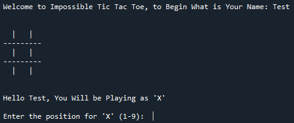

# Tic-Tac-Toe-Ai

You Will Begin by placing the Letter X On a three-by-three grid, You Will Take Turns Marking The Spaces Against an Ai Who Will Play as The Letter O. The player who places three of their marks in a vertical, horizontal, or diagonal row is the winner. However, No Matter How you play, you will only Lose or Tie against the Ai.

The program will ask the user for their name, and a postion to place their letter on the grid

keep playing untill you lose or win against the ai, in this case test lost. The user then will be asked if they want to play again or not
